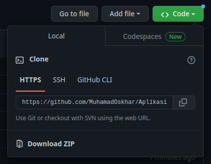
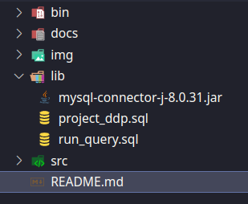
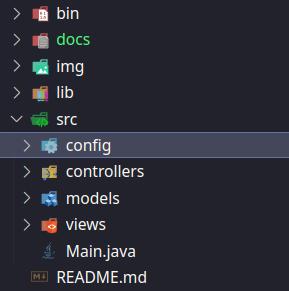
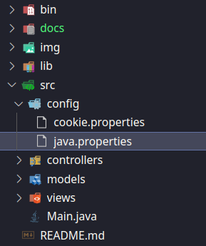
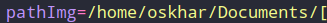
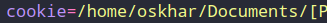
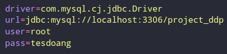
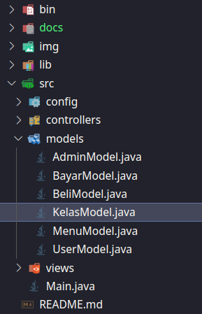

# DOKUMENTASI PROGRAM
####  Dede Latifa Isnaini - 11220910000034 Muhamad Oskhar Mubarok - 11220910000042 Muhammad Fatihul Choir - 11220910000121
####  Prihal terkait pembuatan dokumentasi:

* **Title**: Tugas Akhir Mata kuliah Dasar Dasar Pemrograman
* **Application**: Penjualan Minuman Starbucks
* **Date**: 14 Desember 2022
* **Confidentiality**: Comercial

###  Ⓒ Universitas Islam Negeri Jakarta 2022

##  Deskripsi Singkat

Aplikasi untuk menjual minuman Starbucks yang dilengkapi dengan halaman admin guna memonitoring sekaligus mengatur jalannya penjualan, kalian dapat click dua link di bawah ini untuk mengetahui cara menggunakan aplikasi dan konsep pembuatan aplikasi

> **Note**: Halaman ini hanya berisi cara memasang aplikasi
> * [Cara Menggunakan Aplikasi](/docs/caraPakai.md)
> * [Konsep Pembuatan Aplikasi](/docs/dokumentasiSystem.md)

## Tujuan Pembuatan

Pembuatan aplikasi ini bertujuan untuk:
* Menyelesaikan `tugas akhir` semester 1
* Mengasah kemampuan `kerja sama tim` dalam perkerjaan di bidang IT
* `Menerapkan` pelajaran yang sudah dipelajari selama 1 semseter
* Sedikit mencicipi perkerjaan di `bidang IT`

> Meski masih semester satu kami tetap mengutamakan kualitas dan mengerjakannya semaksimal mungkin sebagaimana semestinya seperti pada medan yang sesungguhnya

## Struktur Folder

Demi pemeliharaan dan pengembangan aplikasi yang lebih terjaga, kami membagi folder menjadi beberapa bagian:

* `src`: folder untuk memelihara source code pada aplikasi
  - `config`: folder untuk proses konfigurasi aplikasi agar berjalan dengan sesuai
  - `models`: folder khusus untuk mengatur data atau model dari program
  - `views`: folder khusus untuk mengatur tampilan aplikasi
  - `controllers`: folder khusus untuk mengelola data dan mengubungkan antara view dan model
* `lib`: folder untuk tempat depedensi program
* `img`: folder untuk menyimpan semua gambar

**Note**: File compile sebagai output akan dialihkan ke dalam folder `bin` sebagai binary folder default.

## Pemasangan Aplikasi

**A. Persiapan instalasi**
  1. **Install** jdk versi 11
  2. **Install** / **siapkan** IDE sebagai media pengembangan
  3. **Download** / **git-clone** Aplikasi penjualan Starbucks 
  
  4. **Install** & **konfigurasi** database mysql
    a. **import** file sql backup yang berada di folder lib nama file "project_ddp.sql" 
    

**B. Konfigurasi sistem**
  1. **Masuk** folder src dan masuk ke folder config 
  
  2. **Buka** file java.properties 
  
  3. **Ubah** pathImg sesuai dengan lokasi folder img 
  
  4. **Ubah** cookie sesuai dengan lokasi file cookie.properties 
  
  5. **Atur** Driver dan sql sesuai selera anda 
  
  6. **Masuk** folder Models dan buka file KelasMode.java 
  
  

    