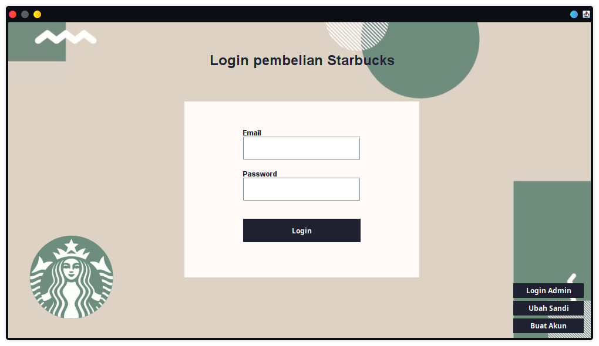
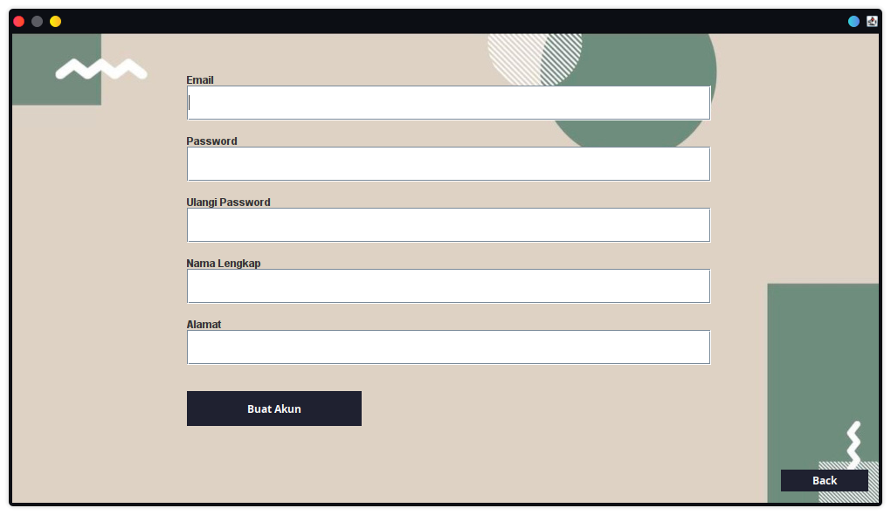
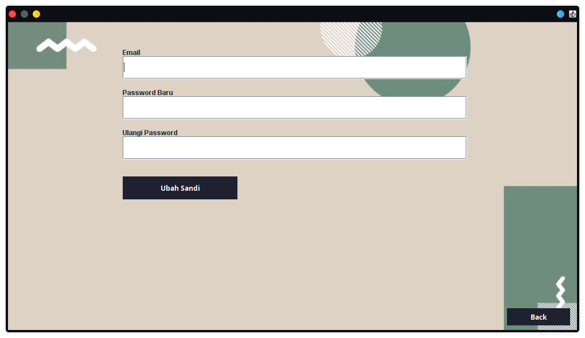
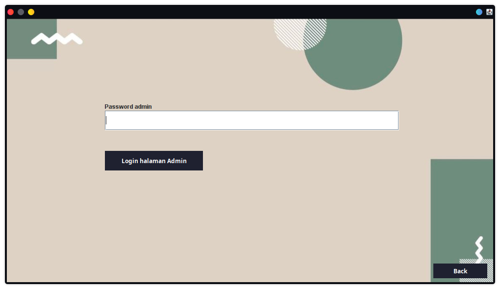

# DOKUMENTASI PRODUK

## Pendahuluan

Pada dokumentasi ini saya akan menjelaskan bagaimana cara untuk menggunakan aplikasi ini dan cara memanfaatkan fitur sebaik mungkin demi meningkatkan produktifitas user

> Untuk siapa aplikasi ini digunakan?
> Aplikasi ini dapat digunakan oleh pembeli untuk membeli product dan juga digunakan oleh produsen yang memonitoring jalannya bisnis perusahaan.

## Penggunaan Aplikasi

**A. Halaman login**
  1. **Masukan** username/email dan password yang sesuai untuk menuju ke halaman selanjutnya 
  
  2. **Jika** anda belum memiliki akun anda dapat menuju ke halaman buat akun, untuk membuat akun anda sendiri secara gratis 
  
    + Anda tidak dapat menggunakan email yang sudah digunakan
    + Password harus terdiri lebih dari 6 karakter
    + Isi input pada ulangi password harus sesuai dan serupa dengan Password
    + Akan muncul notifikasi data invalid saat user tidak memasukan apapun pada input
  3. **Jika** anda melupakan password atau ingin mengubah password yang sudah tersedia, anda dapat mengaturnya di halaman ubah password 
  
    + Akan muncul notifikasi data invalid saat user tidak memasukan data
    + Email yang tidak terdaftar tidak dapat melakukan penggantian password 
    + Password harus terdiri lebih dari 6 karakter
  4. **Admin** bisa langsung menuju halaman admin dan memasukan password yang sesuai untuk autentikasi 
  
**B. Halaman menu**
  1. **Ada** cukup banyak minuman yang dapat anda beli sesuai keinginan, Click salah satu untuk membeli produk yang anda pilih
  2. **Logo** keranjang belanjaan dapat anda click untuk menuju halaman pembayaran
  + **Logo** akan memiliki notifikasi unik saat keranjang terisi
  + **Notifikasi** pada logo akan hilang jika isi keranjang anda kosongkan kembali
**C. Halaman beli**
  1. **User** dapat mengatur jumlah produk yang dibeli sesuai kebutuhan dengan tombol plus dan tombol minus
  2. **User** bisa langsung menuju halaman bayar dengan mengclick tombol `beli`
  3. **Jika** hanya ingin menyimpan produk ke dalam keranjang user dapat click tombol `tambah keranjang` 
